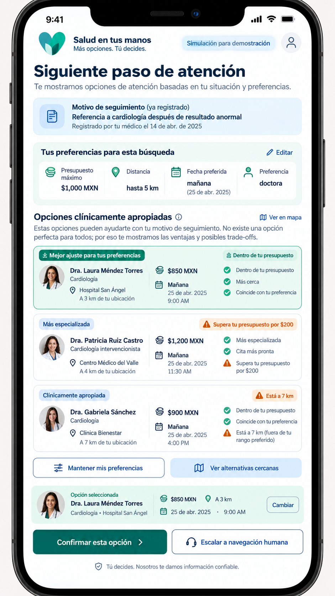

# Week 5 — PACKET

**Role:** USER  
**Vacuum:** Detection-to-Treatment Navigation  
**Core principle:** The system organizes; the human chooses.

---

## 1. Problem in My Words

Finding out that you need medical follow-up does not mean you can actually get care.

After an abnormal test, referral, screening result, or clinician instruction, a patient still has to find an appropriate provider, understand the price, compare distance and availability, and decide whether the option fits their real life.

The problem I am attacking is the gap between a legitimate medical follow-up need and an achievable next step.

This product does not diagnose symptoms. It begins only after a legitimate medical trigger already exists.

The system organizes appropriate options and explains their tradeoffs. The patient chooses the doctor, price, location, and date.

---

## 2. Exact User

A patient in Mexico who already has a legitimate medical follow-up trigger, such as:

- an abnormal test result,
- a referral,
- a screening result,
- or a clinician instruction.

The patient needs help finding a realistic next step while balancing constraints such as:

- budget,
- distance,
- availability,
- provider preference,
- and personal schedule.

The patient should not need technical medical knowledge to compare the options.

---

## 3. Success Definition

**Before the module closes, a synthetic patient with an existing medical follow-up need can enter practical constraints, compare clinically appropriate simulated care options, understand the tradeoffs between them, and personally approve the doctor, price, location, and date.**

If no option matches every preference, the prototype clearly explains which constraint would need to change and lets the patient choose whether to keep their preferences or see the closest alternatives.

---

## 4. Image-Generated Mockup



The mockup should show a mobile-first patient navigation screen in Spanish.

The screen should include:

- a clear existing follow-up need,
- budget,
- distance/location,
- preferred date,
- provider preference,
- several simulated care options,
- an explanation of why each option is shown,
- visible price, distance, and availability,
- a tradeoff warning when an option breaks a preference,
- a button to keep preferences even if care is delayed,
- a button to show the closest alternatives,
- and a final action where the patient chooses an option.

All demo information must be invented and labeled as simulated.

---

## 5. Flow Diagram

```mermaid
flowchart TD
    A[Legitimate medical follow-up trigger already exists]
    B[Patient opens navigation tool]
    C[Patient enters practical constraints]
    D[System filters simulated clinically appropriate options]
    E{Does an option match all preferences?}
    F[Show matching options]
    G[Explain that no option matches every preference]
    H[Patient chooses: keep preferences or see closest alternatives]
    I[Show options with explicit tradeoffs]
    J[Patient compares doctor, price, location and date]
    K[Patient selects preferred option]
    L[Patient confirms final choice]
    M{Human escalation needed?}
    N[Escalate to human navigator]
    O[Show confirmed simulated next action]

    A --> B
    B --> C
    C --> D
    D --> E
    E -->|Yes| F
    E -->|No| G
    G --> H
    H --> I
    F --> J
    I --> J
    J --> K
    K --> L
    L --> M
    M -->|Yes| N
    M -->|No| O
    N --> O

